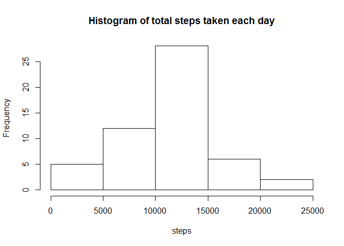
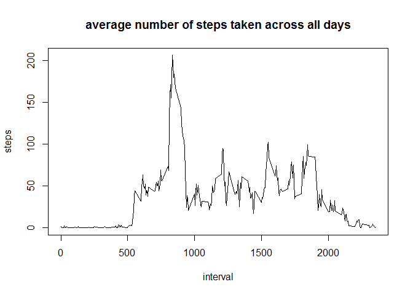
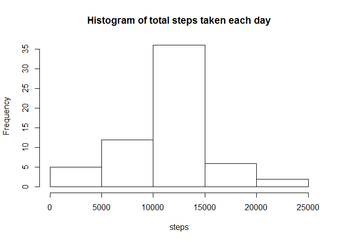
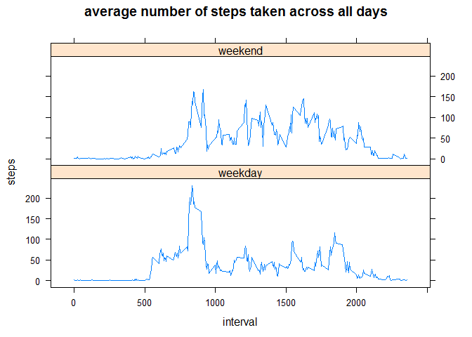

# Reproducible Research: Peer Assessment 1


## Loading and preprocessing the data

```r
library(dplyr)
```

```
## 
## Attaching package: 'dplyr'
```

```
## The following objects are masked from 'package:stats':
## 
##     filter, lag
```

```
## The following objects are masked from 'package:base':
## 
##     intersect, setdiff, setequal, union
```

```r
activity <- read.csv("data/activity.csv", stringsAsFactors = FALSE)
activity$date <- as.Date(activity$date, format = "%Y-%m-%d")
head(activity)
```

```
##   steps       date interval
## 1    NA 2012-10-01        0
## 2    NA 2012-10-01        5
## 3    NA 2012-10-01       10
## 4    NA 2012-10-01       15
## 5    NA 2012-10-01       20
## 6    NA 2012-10-01       25
```

## What is mean total number of steps taken per day?
Histogram of total steps taken each day

```r
activityByDay <- activity %>% group_by(date)
spd<- activityByDay %>% summarise(steps = sum(steps))
hist(spd$steps,main = "Histogram of total steps taken each day", xlab = "steps")
```

<!-- -->

Mean and median of the total number of steps taken per day

```r
mean(spd$steps, na.rm = TRUE)
```

```
## [1] 10766.19
```

```r
median(spd$steps, na.rm = TRUE)
```

```
## [1] 10765
```

## What is the average daily activity pattern?

```r
activityByInterval <- activity %>% group_by(interval)
averageSteps<- activityByInterval %>% summarise(steps = mean(steps, na.rm=TRUE))
plot(x = averageSteps$interval, y = averageSteps$steps, type = "l", main = "average number of steps taken across all days", xlab = "interval", ylab = "steps")
```

<!-- -->

Which 5-minute interval, on average across all the days in the dataset, contains the maximum number of steps?

```r
averageSteps$interval[averageSteps$steps==max(averageSteps$steps)]
```

```
## [1] 835
```

## Imputing missing values
total number of rows with NAs

```r
sapply(activity,function(x) sum(is.na(x)))
```

```
##    steps     date interval 
##     2304        0        0
```
Replace NAs with interval mean

```r
activityNoNulls <- activityByInterval %>% mutate(steps = ifelse(is.na(steps),mean(steps, na.rm=TRUE),steps))

sapply(activityNoNulls,function(x) sum(is.na(x)))
```

```
##    steps     date interval 
##        0        0        0
```
Make a histogram of the total number of steps taken each day 

```r
spd_noNulls <- activityNoNulls %>% group_by(date) %>% summarise(steps = sum(steps))
hist(spd_noNulls$steps,main = "Histogram of total steps taken each day", xlab = "steps")
```

<!-- -->

Calculate and report the mean and median total number of steps taken per day. 

```r
mean(spd_noNulls$steps)
```

```
## [1] 10766.19
```

```r
median(spd_noNulls$steps)
```

```
## [1] 10766.19
```
Do these values differ from the estimates from the first part of the assignment? What is the impact of imputing missing data on the estimates of the total daily number of steps?
1. Mean stayed the same as we imputed values with mean per interval
2. Median went up by a little and now equanl the mean

## Are there differences in activity patterns between weekdays and weekends?

```r
weekend <- weekdays(activityNoNulls$date)
weekend[weekend %in% c("Saturday","Sunday")] <- "weekend"
weekend[weekend != "weekend"] <- "weekday"

activityNoNulls$weekday<-as.factor(weekend)
```

Make a panel plot containing a time series plot (i.e. type = "l") of the 5-minute interval (x-axis) and the average number of steps taken, averaged across all weekday days or weekend days (y-axis).

```r
activityByInterval_wknd <- activityNoNulls %>% group_by(interval,weekday)
averageSteps_wknd<- activityByInterval_wknd %>% summarise(steps = mean(steps, na.rm=TRUE))

library(lattice)
xyplot(steps~interval | weekday,data=averageSteps_wknd, type="l", main = "average number of steps taken across all days", layout = c(1,2))
```

<!-- -->
